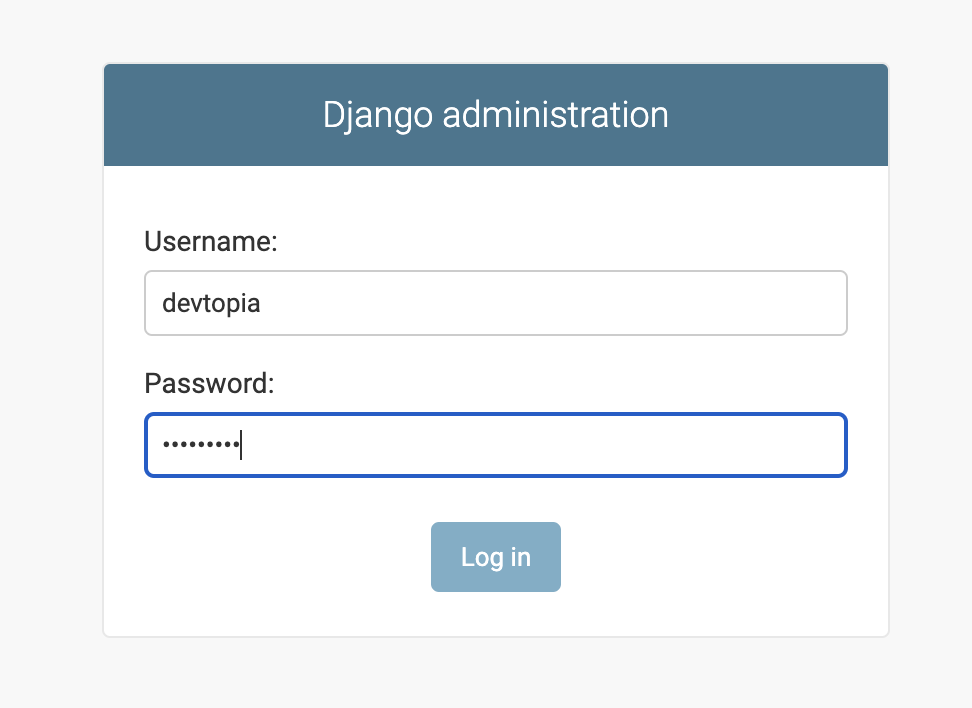
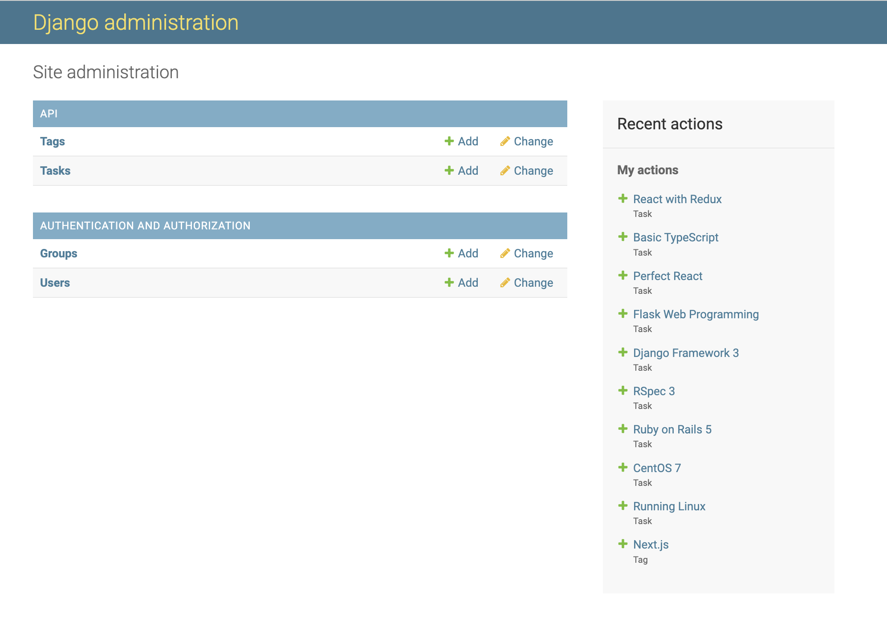
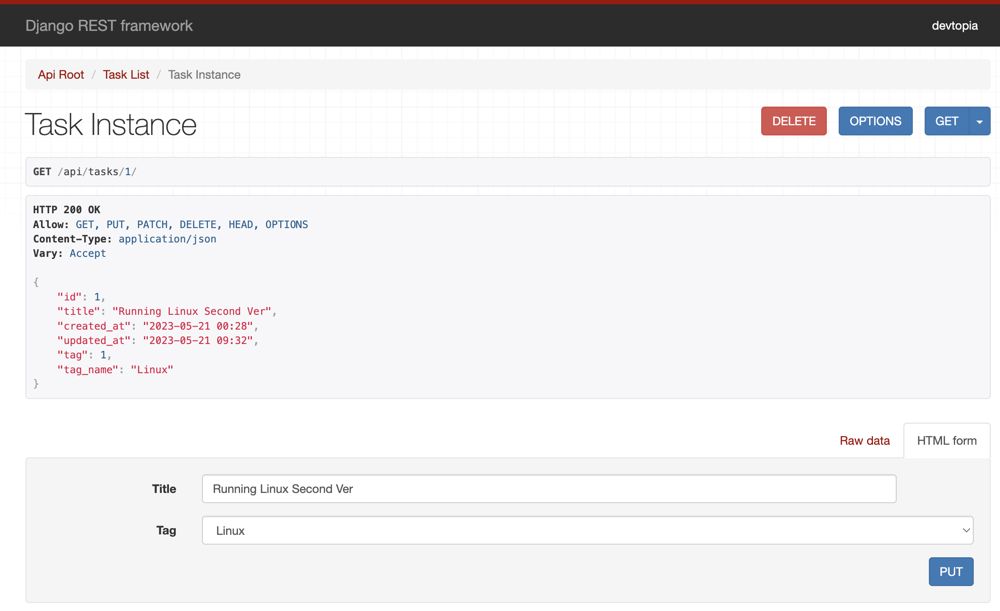
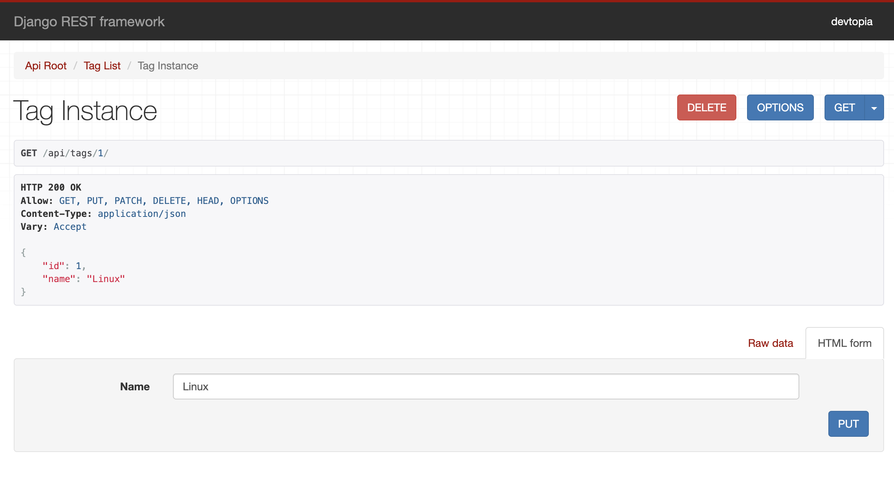

# High Performance React Web 開発

https://www.udemy.com/share/104CFu3@vZWokXsE60n4G3KVANnZpC-AriSKQsKYryoqQERsM0zr4DuDyH3cVza4mWSKhaa1-g==/

Kazu T+さんの講座でReact QueryとReduxでTodoアプリを作ります。
このリポジトリはDjango REST Frameworkで作成したバックエンド側です。

Django REST Frameworkについては[公式サイト](https://www.django-rest-framework.org/)を確認してください。

## Pythonの環境構築

私はpyenvとvirtualenvを組み合わせて使っていますが、各自使っているPythonの環境で結構です。

```sh
brew install pyenv
brew install pyenv-virtualenv
```

pyenvで最新バージョンのPythonをインストールします。
pyenv install -lでインストールできるPythonのリストが表示されます。
私は現時点の最新である3.11.3をインストールしました。

```sh
# インストールできるPythonのリストを確認
pyenv install -l

# pythonをインストールする。
pyenv install 3.11.3

# インストールしたPythonのバージョンを確認
pyenv versions

# virtualenvを生成
pyenv virtualenv 3.11.3 django_restapi
```

プロジェクトのRootディレクトリーを生成して使いたいPythonを指定します。

```sh
mkdir django_restapi
cd django_restapi
pyenv local
```

これでこのプロジェクトに入ると自動でPython 3.11.3の仮装環境が用意されました。

## プロジェクトの生成及びスタート

```sh
cd django_restapi
pip install -r requirements.txt
```

Databaseマイグレーションファイルを生成します。

```sh
python manage.py makemigrations
```

Databaseマイグレーションを行います。

```sh
python manage.py migrate
```

Database管理用のsuper userを生成します。

```sh
python manage.py createsuperuser
```

django RESTサーバーを立ち上げます。

```sh
python manage.py runserver
```

## サーバーの確認

Djangoの場合はadmin（管理ツール）をデフォルトで提供していて、マイグレーションを実行することでモデルファイルを元に自動でテーブルを生成します。そして、そのテーブルは管理ツールで操ることができます。

* 管理ツール

http://localhost:8000/admin

上記で生成したsuper userでログインします。



Addボタン押してデータを追加します。



DjangoだけではなくDjango REST Frameworkというライブラリーもインストールしないといけません。
pip install -r requirements.txtでライブラリーをインストールしたら、特に問題はありません。

* apiのルート

http://localhost:8000/api

* Taskの場合

http://localhost:8000/api/tasks



* Tagの場合

http://localhost:8000/api/tags


